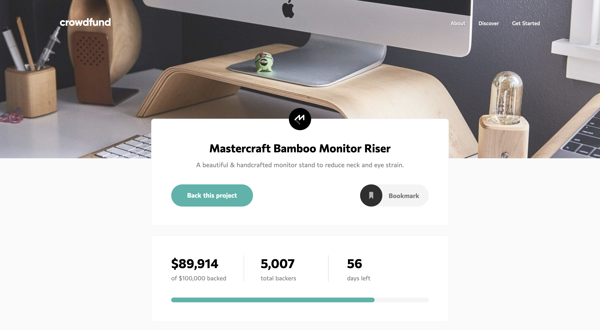

# Frontend Mentor - Crowdfunding product page solution

This is a solution to the [Crowdfunding product page challenge on Frontend Mentor](https://www.frontendmentor.io/challenges/crowdfunding-product-page-7uvcZe7ZR). Frontend Mentor challenges help you improve your coding skills by building realistic projects.

## Table of contents

- [Overview](#overview)
  - [The challenge](#the-challenge)
  - [Screenshot](#screenshot)
  - [Links](#links)
- [My process](#my-process)
  - [Built with](#built-with)
  - [What I learned](#what-i-learned)
- [Author](#author)

## Overview

### The challenge

Users should be able to:

- View the optimal layout depending on their device's screen size
- See hover states for interactive elements
- Make a selection of which pledge to make
- See an updated progress bar and total money raised based on their pledge total after confirming a pledge
- See the number of total backers increment by one after confirming a pledge
- Toggle whether or not the product is bookmarked

### Screenshot



### Links

- Live Site URL: [https://bqshina.github.io/My-Portfolio/projects/crowdfunding-product-page-main/index.html](https://bqshina.github.io/My-Portfolio/projects/crowdfunding-product-page-main/index.html)

## My process

### Built with

- Semantic HTML5 markup
- CSS custom properties
- Flexbox
- CSS Grid
- Vanilla JavaScript

### What I learned

Custom style of radio checkmark

To see how you can add code snippets, see below:

```html
<label for="no-reward"
  >Pledge with no reward
  <input type="radio" name="product" id="no-reward" />
  <span class="checkmark first"></span>
</label>
```

```css
.product-card .checkmark {
  position: absolute;
  top: 32px;
  left: 28px;
  height: 24px;
  width: 24px;
  border: 1px solid rgba(0, 0, 0, 0.15);
  border-radius: 50%;
}
.product-card .checkmark:after {
  content: "";
  position: absolute;
  display: none;
  height: 12px;
  width: 12px;
  top: 50%;
  left: 50%;
  transform: translate(-50%, -50%);
  border-radius: 50%;
  background-color: var(--moderate-cyan);
}
```

```js
for (let i = 0; i < productRadios.length; i++) {
  productRadios[i].onclick = () => {
    if (productRadios[i].checked) {
      productCards[i].classList.add("active");
    }
    checkAcitveCard(i);
  };
}
```

## Author

- Website - [Shina Qin](https://bqshina.github.io/My-Portfolio/)
- Frontend Mentor - [@bqShina](https://www.frontendmentor.io/profile/bqShina)
- Twitter - [@xiaohan_qin](https://www.twitter.com/xiaohan_qin)
