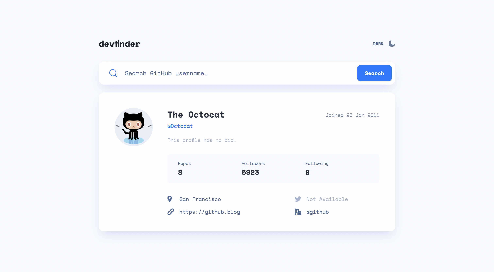

# Frontend Mentor - GitHub user search app solution

This is a solution to the [GitHub user search app challenge on Frontend Mentor](https://www.frontendmentor.io/challenges/github-user-search-app-Q09YOgaH6). Frontend Mentor challenges help you improve your coding skills by building realistic projects.

## Table of contents

- [Overview](#overview)
  - [The challenge](#the-challenge)
  - [Screenshot](#screenshot)
  - [Links](#links)
- [My process](#my-process)
  - [Built with](#built-with)
- [Author](#author)

## Overview

### The challenge

Users should be able to:

- View the optimal layout for the app depending on their device's screen size
- See hover states for all interactive elements on the page
- Search for GitHub users by their username
- See relevant user information based on their search
- Switch between light and dark themes
- **Bonus**: Have the correct color scheme chosen for them based on their computer preferences. _Hint_: Research `prefers-color-scheme` in CSS.

### Screenshot

### Links

- Live Site URL: [https://bqshina.github.io/My-Portfolio/projects/github-user-search-app/index.html](https://bqshina.github.io/My-Portfolio/projects/github-user-search-app/index.html)

## My process

### Built with

- Semantic HTML5 markup
- CSS custom properties
- Flexbox
- CSS Grid
- Vanilla JavaScript
- Fetch API

## Author

- Website - [Shina Qin](https://bqshina.github.io/My-Portfolio/)
- Frontend Mentor - [@bqShina](https://www.frontendmentor.io/profile/bqShina)
- Twitter - [@xiaohan_qin](https://www.twitter.com/xiaohan_qin)
